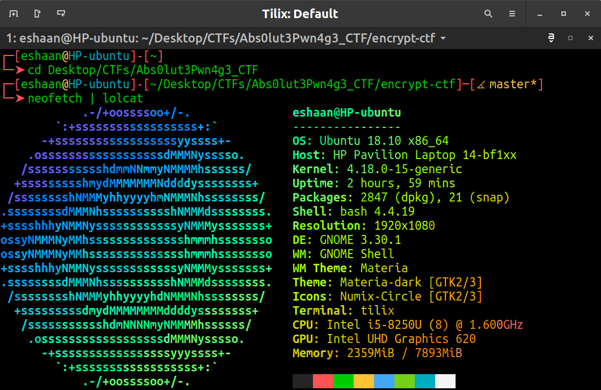

# ParrotTerm

<strong>ParrotSec</strong> style terminal theme for robbyrussell's [oh-my-zsh](https://github.com/robbyrussell/oh-my-zsh) based on this awesome theme [blokkzh](https://github.com/KorvinSilver/blokkzh) theme. 

## Installation

Make sure you have a font with Unicode support installed, eg. the Noto font family.

### [Oh-My-Zsh](http://ohmyz.sh/)

To install, follow [these instructions](https://github.com/robbyrussell/oh-my-zsh/wiki/Customization#overriding-and-adding-themes)

You can also use the [blokkzh-downloader](https://github.com/KorvinSilver/blokkzh/blob/master/blokkzh-downloader.zsh) script included in this repo.

Alternatively, you can execute this command:
`curl -O https://raw.githubusercontent.com/Eshaan7/ParrotTerm/master/ParrotTerm-downloader.zsh && zsh ParrotTerm-downloader.zsh $ZSH_CUSTOM && rm ParrotTerm-downloader.zsh`

## Screenshots

### xterm

